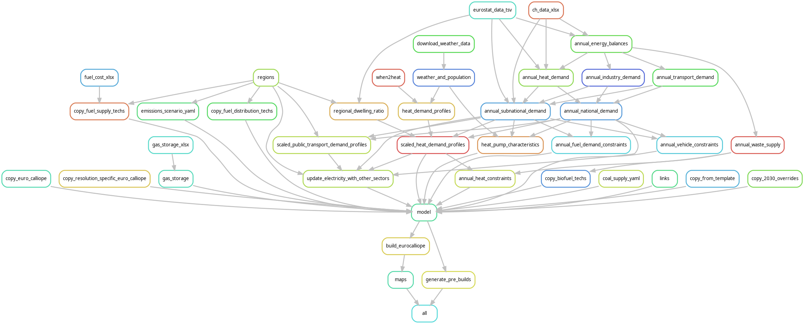

# Sector-coupled Euro-Calliope Model with 98 European regions

This snakemake workflow builds upon Euro-Calliope v1.0 with the following:

1. Representation of transport, heat, and industry sectors. These sectors lead to the addition of unique carriers and technologies, and associated myriad of input datasets.
2. Bespoke clustering of NUTS3 regions to create an intermediate resolution model of Europe, consisting of 98 regions.
3. Inclusion of Iceland in the energy system model.
4. Use of grid transfer capacities (GTCs) from the E-Highways 2050 Euroepan project to place limits on line capacity between regions.
5. Inclusion of proposed/planned new AC and DC lines connecting regions, according to ENTSOE.

The resulting energy system transmission network is:

The key rules of the workflow shown graphically are:

This worflow currently relies on updated versions of the [euro-calliope](https://github.com/brynpickering/euro-calliope/tree/sector-coupled) and [solar-and-wind-potential](https://github.com/brynpickering/possibility-for-electricity-autarky/tree/custom-regions) workflows. The correct versions of these subworkflows are given as git submodules in this repository.

## Building and running the model
To run the Sector-Coupled Euro-Calliope workflow, you need to undertake the following steps:

1. Clone this repository, including the submodules: `git clone --recurse-submodules git@github.com:calliope-project/sector-coupled-euro-calliope.git`
2. Populate the different subworkflow data directories with manual data.
In each subworkflow README you can find the list of necessary data sources.
There is some overlap in data sources (e.g., the Exclusive Economic Zones) which can be symlinked between directories (see point 3).
There is no need to include capacity factor data in the `./land-eligibility` workflow.
3. copy (or symbollically link) data between the workflow levels:
    1. `./data/nuts_to_regions.csv` should also be available in `./land-eligibility/data`.
    2. `World_EEZ_v10_20180221` is required in both `./land-eligibility/data` and `./euro-calliope/data`.
4. Install the base conda environment: `conda env create -f environment.yaml` + `conda activate sector-coupled-euro-calliope`.
5. Build the Calliope model definition by runnning the workflow from the top level (same place as this file can be found): `snakemake --use-conda --cores 1` (You can change the number of cores, or run using the cluster profile by adding the argument `--profile config/euler`).
If you need to rebuild something from a subworkflow, then you should `cd` into the relevant directory and run snakemake from there: `cd ./land-eligibility` + `snakemake --use-conda --cores 1 [path/to/file]`; `snakemake --configfile ../config/euro-calliope-2050.yaml --use-conda --cores 1 [path/to/file]`.
6. Optimise the built model. This can be done in one of two ways:
    1. use snakemake directly (e.g. `snakemake --use-conda --profile config/euler "build/eurospores/outputs/run_2018_2H_neutral.nc"`)
    2. use separate run scripts found in the directory `run_scripts`. These scripts are decoupled from the workflow since they can take a very long time to run and can clash with snakemake's file watching processes. The run scripts are suitable for use on a high performance computer using the LSF software.

## Troubleshooting

There are a number of issues you may come across when trying to run this workflow.
Many of these issues will be solved in upcoming releases.

1. `./land-eligibility/data/automatic/raw-wdpa.zip` fails to be downloaded or fails to open.
This occurs since the WDPA dataset is versioned, but there is only ever one version available on the web server.
Therefore, the version you need to download will likely have a different version than expected in the workflow.
This can be solved by updating the land-eligibility configuration parameter `["parameters"]["wdpa-year"]` to match that found on the WDPA server.

2. Not enough disk space/memory to run scripts.
This full workflow is designed to be run on a high performance computing cluster.
If you want to create specific files that you know should have a low resource requirement, you can ask snakemake to create that file specifically: `snakemake [arguments] "build/path/to/file"`

3. Snakemake rules not being triggered in subworkflows.
Due to an enresolved bug, you may find that from the top-level workflow, snakemake doesn't think there is anything to do in the subworkflows, even if no data exists in them.
You can solve this by going into the individual workflow directories and running them directly from there.
See the `Building and running the model` above for more information.

4. Choosing between 2030 and 2050 projection year.
The workflow has two sets of assumptions for demand and supply technology characteristics, depending on the "projection" year.
You can simply change the `projection_year` option in the main workflow configuration file to switch between the two.
If running from the main workflow, this will pass the correct information down to the `euro-calliope` sub-workflow.
If running from within the `euro-calliope` sub-workflow, you should make sure to point to the correct configuration file (`../config/euro-calliope-2030.yaml` or `../config/euro-calliope-2050.yaml`).

5. Running for a subset of countries in Europe.
This is not exactly possible in the current formulation of the workflow, since all countries are needed to enable gap filling (where some countries are used to fill in for others).
Your best bet is to instead run for all countries and then exclude certain regions when building and running the Calliope model.

6. Changing the composition of regions.
The file `nuts_to_regions.csv` maps NUTS3 regions to user-defined Euro-Calliope regions.
If you would like to update the grouping of regions, you can do so here.

## Citation

If you use this workflow or the pre-built Sector-Coupled Euro-Calliope model, please cite:

Pickering, B., Lombardi, F., Pfenninger, S., 2022. Diversity of options to eliminate fossil fuels and reach carbon neutrality across the entire European energy system. Joule. [DOI:10.1016/j.joule.2022.05.009](https://doi.org/10.1016/j.joule.2022.05.009)
